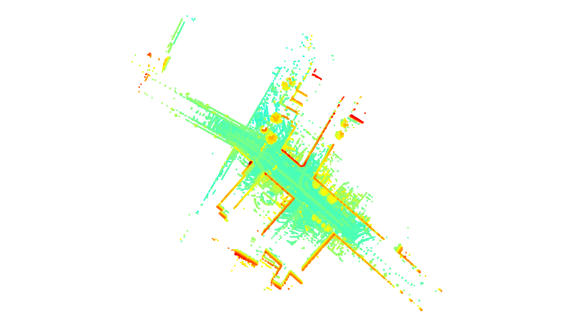
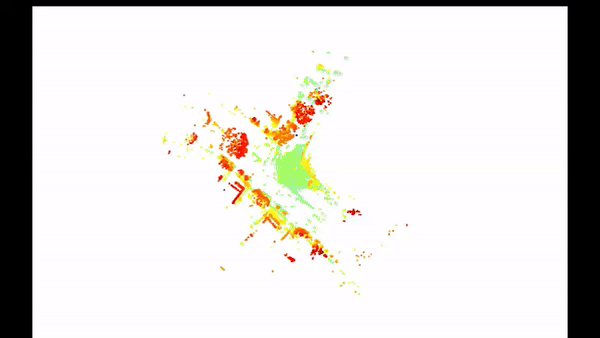
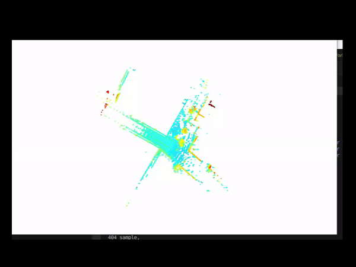
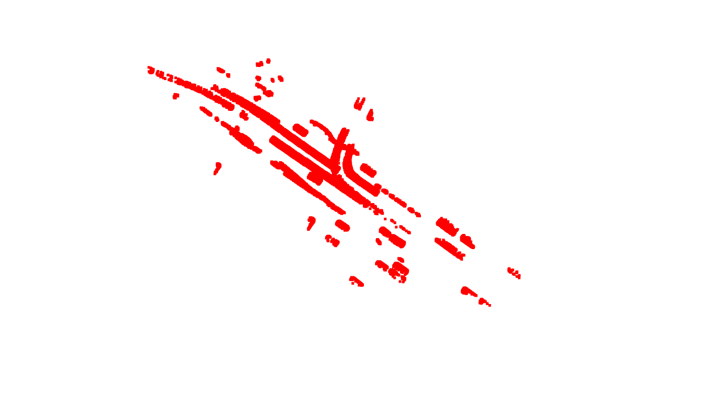
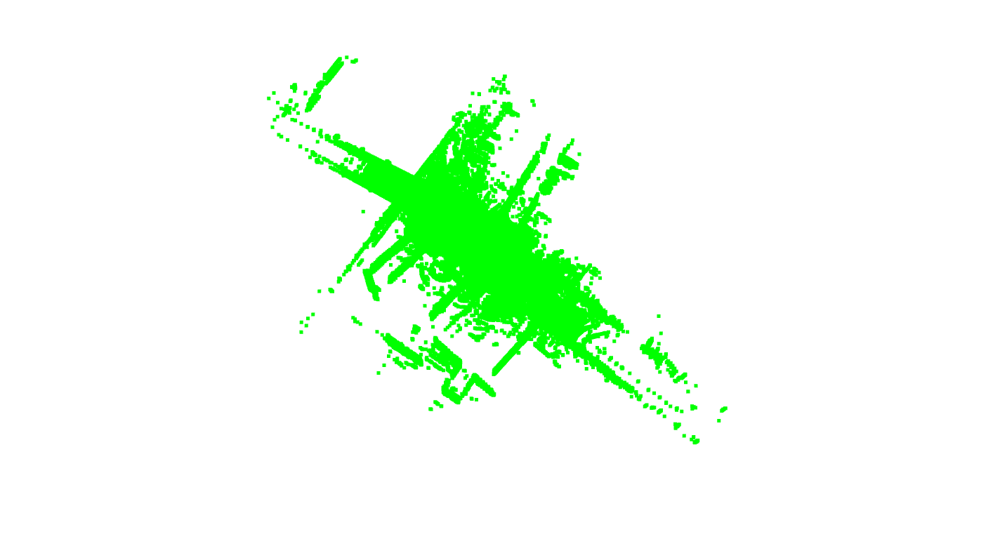
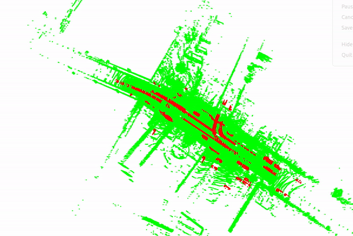
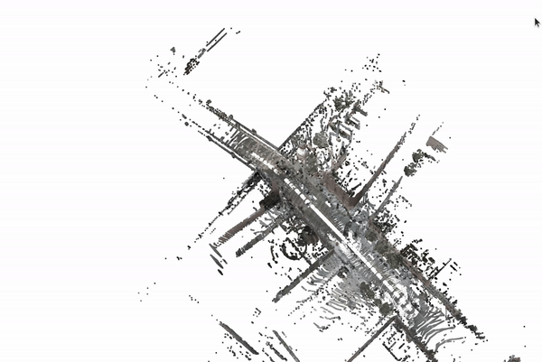

# Lidar Data processing with nuScenes Dataset

This project implements a Lidar data  Processing using the KITTI Odometry dataset. 
## Table of Contents
1. [Project Setup](#project-setup)
2. [About the NuScenes Dataset](#about-the-NuScense-dataset)
3. [Tasks](#Task)
   - Lidar Point Cloud aggregation 
   - Moving Object Filtering 
   - Colorizing Point Cloud
6. [Usage](#usage)
7. [References](#references)

## Project Setup

### Requirements

To run the project, you need the following dependencies:


- Python 3.x ()


You can install the necessary dependencies using:

```bash
sudo apt-get install python3

```


## About Dataset 
he NuScenes dataset is widely used in autonomous driving research. It contains data captured from a vehicle driving in urban environments, including camera images, LIDAR data, RADAR data, and GPS data.

To use the NuScenes dataset for various tasks, download the following datasets::
  1.Full Dataset - [KITTI website](http://https://www.nuscenes.org/download).
  
Once downloaded, unzip the datasets and place in the  `dataset` folder organize them in the following structure:
``` bash
nuscenes_dataset/
    ├── samples/
    │   ├── CAM_FRONT/
    │   ├── CAM_FRONT_LEFT/
    │   ├── CAM_FRONT_RIGHT/
         .....
    ├── sweeps/
    │   ├── LIDAR_TOP/
    │   ├── RADAR_FRONT/
        .....
    ├── maps/
    ├── v1.0-mini/
    │   ├── samples/
    │   ├── sweeps/
    │   ├── maps/
    │   ├── v1.0-mini/
    ├── v1.0-trainval/
    │   ├── samples/
    │   ├── sweeps/
    │   ├── maps/
    │   ├── v1.0-trainval/
```
## Project Setup
1. Clone the repository
```bash 
git clone git@github.com:eliyaskidnae/Monocluar_VO.git
cd Monocluar_VO
```

2. Copy the `dataset` folder inside the project folder 

## Tasks 1
Because the dataset is huge we select one scene to do the tasks 
### Point Cloud Aggregation

The process of aggregating point clouds involves the following steps:

1. **Load Lidar Point Cloud Data:** Load Lidar point cloud data from the NuScenes dataset for each keyframe.

2. **Transform Point Clouds to Global Coordinate System:** Use the vehicle's ego pose and Lidar-to-base transformation to transform the point clouds to the global coordinate system.

3. **Aggregate Transformed Point Clouds:** Aggregate the transformed point clouds in the global coordinate system to create a comprehensive view of the environment.


<div style="display: flex; justify-content: space-between;">
  <div> 
    
     <p style="text-align: center;">Figure 1: Aggregated pointcloud</p>

  </div>
</div>

| sample 1 | sample 2 |
|:---------------:|:-----------------------:|
| <br> *Aggregated Pointcloud* |  <br> Aggregated Pointcloud2|


## Task2: Moving Object Filtering

to detect moving object we use annotation from the dataset which tells as possible moving objects and their bounding box.then we track those dynamic objects on each sequence to calculate the velocity between two frames and if the velocity is higher than threshold  velocity we filter pointclouds fall in the bounding box of moving objects and assign them to moving object pointcloud and the remaining as static pointcloud.
<div style="display: flex; justify-content: space-between;">
  <div> 
    
     <p style="text-align: center;">Figure 1: moving object pointcloud</p>
  </div>
  <div> 
    
     <p style="text-align: center;">Figure 1: static object pointcloud</p>
  </div>
</div>


red color for moving object and green color for static pointcloud
| <br> *moving and static Pointcloud* 
## Task3 Point Cloud Colorization

To colorize a point cloud using image data, the vehicle's camera sensors capture the scene. Using the camera's extrinsic and intrinsic parameters, the point cloud is projected onto the image plane. Points falling within the image boundaries and having positive depth information are filtered. Finally, the color values of the corresponding image pixels are extracted and assigned to the point cloud data.
| colored pointcloud|
|:---------------:|
| <br> *colored Pointcloud* | 